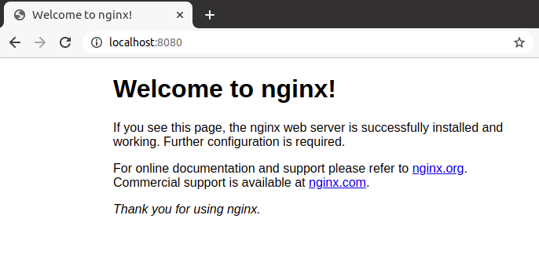

# helm-discovery
An interation based approach to develop a sounder understanding of Helm

## Iteration 1

What is helm? Let's get a very simple example.

Helm is useful to help one manage the endless number of YAML files a Kubernetes cluster starts to accumulate. I hear they call Helm a package manager for Kubernetes.

I read [somewhere](https://harness.io/blog/continuous-delivery/what-is-helm/) that a Helm chart is an executed template converting Chart definitions to Kubernetes manifests. This is getting interesting, but I need some more concrete stuff to visualize it.

There seems to be four elements in a Helm chart: 
- a Chart.yml
- a Values.yml
- Charts Directory for other charts
- Templates (Directory)

I found [here](https://opensource.com/article/20/5/helm-charts) that  all Helm charts follow the same structure while still having a structure flexible enough to represent any type of application you could run on Kubernetes. Nice!

Am I right thinking that Helm charts are the Terraform of Kubernetes? Kind of, but not really. In fact, I could manage Kubernetes with Terraform, Terraform has a Kubernetes provider. However, Helm seems to be the favourite for managing Kubernetes manifests.

Ok, let's build a simple Nginx webserver using Helm charts. I think I will need a deployment and a service.

First step is to create a chart using my Helm binary ([installation guide](https://helm.sh/docs/intro/install/))  
`$ helm create nginx-webserver`

Looking at the files and folders created in `iteration-1/nginx-webserver/`, the folder structure is:

    .
    └── nginx-webserver
        ├── charts
        ├── Chart.yaml
        ├── templates
        └── values.yaml

This is a Helm Chart! HoHoo! Great success! I think it is fair to say that we can have one Helm Chart per application, in this case an Nginx Web Server.

Let's analyse each file and folders. We get some basic information on the `Chart.yaml` file. Now the `templates` folders seems more interesting. It has a bunch of files which seem to be templates for the manifests that Helm creates. There are a few common resources: deployment, service, ingress, serviceaccount, hpa and ingress. I assume other templates will somehow be added to this templates. I can guess that there will be some template generator somewhere.

The folder  `charts` is empty and will be used to keep dependent charts, I think they are called sub-charts but this is something I will need to verify ahead.

I'm getting impatient. How do I launch the webserver?

Helm will launch the application making use of the templates. How are they filled? The values in the file `values.yaml` do that. Ok, so this is the first file I need to edit. This file is already pulling a nginx image so I will keep it as it is and try to spin it up somehow. From the keywords I am seeing on the file it looks as if it will create a service account, probably a pod, a service and an ingress.

Let's get on with it! Deploy my dear:  

```sh
$ helm install nginx-chart iteration-1

NAME: nginx-chart
LAST DEPLOYED: Thu May 27 16:37:18 2021
NAMESPACE: default
STATUS: deployed
REVISION: 1
NOTES:
1. Get the application URL by running these commands:
  export POD_NAME=$(kubectl get pods --namespace default -l "app.kubernetes.io/name=nginx-webserver,app.kubernetes.io/instance=nginx-chart" -o jsonpath="{.items[0].metadata.name}")
  export CONTAINER_PORT=$(kubectl get pod --namespace default $POD_NAME -o jsonpath="{.spec.containers[0].ports[0].containerPort}")
  echo "Visit http://127.0.0.1:8080 to use your application"
  kubectl --namespace default port-forward $POD_NAME 8080:$CONTAINER_PORT

```

Did something appear in our cluster? Hell yeah, look below.

```sh
$ kubectl get all 

NAME                                               READY   STATUS    RESTARTS   AGE
pod/nginx-chart-nginx-webserver-68d949d54f-zdmss   1/1     Running   0          9m27s

NAME                                  TYPE        CLUSTER-IP      EXTERNAL-IP   PORT(S)   AGE
service/kubernetes                    ClusterIP   10.96.0.1       <none>        443/TCP   26h
service/nginx-chart-nginx-webserver   ClusterIP   10.97.197.190   <none>        80/TCP    9m27s

NAME                                          READY   UP-TO-DATE   AVAILABLE   AGE
deployment.apps/nginx-chart-nginx-webserver   1/1     1            1           9m27s

NAME                                                     DESIRED   CURRENT   READY   AGE
replicaset.apps/nginx-chart-nginx-webserver-68d949d54f   1         1         1       9m27s

```

Let's port forward the service and see if it is rolling. The output from the `heml install` command above was kind enough to provide us with the commands to port-forward the application to our localhost on port 8080. After running them, there you have it:
   


This deserves a celebration. We deployed our first Kubernetes service using Helm Charts!

